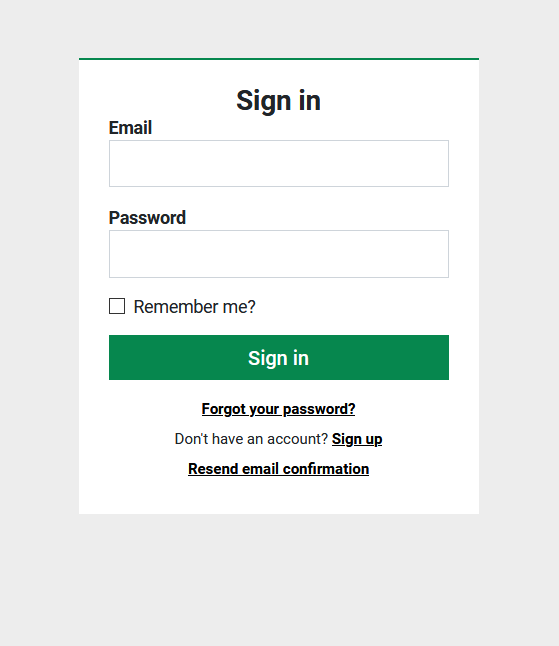

# Transmission Media Web Developer Exercise

Please recreate the form shown in `sign-in-form.png`.

## About this form

* The font used is Roboto, which is available free on Google Fonts.
* The form comprises:
  * Two text input fields (Email/Password)
  * One checkbox field (Remember Me)
  * One button (Sign In)
  * Three links below the Sign In button (underlined)
* Submitting the form should send a request with the user's login details
  to `localhost:8000/api/login`. This request will obviously fail, because
  this endpoint doesn't exist. Implementing a server to handle logins is
  beyond the scope of this exercise! (This is only an interview, after all.)
* Add validation to this form, to warn the user when they've left a field
  blank. We leave it to you to determine where and when these message(s) should
  appear, and how to style them.

## Directions

* Use React to build this page. You may bootstrap with Create React App if
  desired.
* You may use CSS preprocessors like LESS or SASS.
* Do NOT use third-party UI libraries like Bootstrap! We want to see how you
  write your CSS and how you structure components!
* You may use form validation libraries if desired to handle validation logic.
* You may use Typescript, but it's not necessary.
* Submit your code by committing it to a repository on GitHub (or GitLab, or
  Bitbucket -- whatever you prefer), and sending us a link to that repository.
  Bonus points if you also deploy and host this page somewhere (e.g. using
  Heroku or GitHub Pages)! Remember to send us that link as well!

## What we are looking for

* Clean, well-structured code, with comments where necessary.
* The form visually resembles the image we've sent.
* The form is accessible, uses semantic HTML, and provides good user
  experience (UX).
* The form should work and look decent in all evergreen browsers.
* The login request to nowhere should still use a reasonable method and payload
  structure choice.
* Additional features (e.g. validation) you've added fit in well, in terms of
  visual design and function.
* Styling accommodates corner cases that'd probably apply in real life
  (e.g. What if the form was localized and the "Remember Me" label was longer
  than one line in another language?)
* Consideration given to developer experience (DX) (e.g. documentation on how
  to set up your project, good commit messages).

Thank you for taking the time to complete this exercise for us! :)
